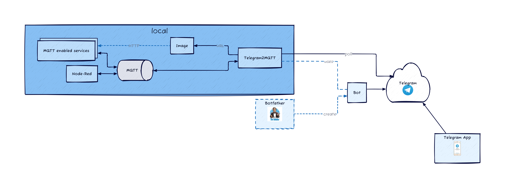

# Telegram2Mqtt

Bidirectional Telegram to MQTT gateway

[](https://github.com/mqtt-smarthome/mqtt-smarthome)
[](https://github.com/Legobas/telegram2mqtt/actions/workflows/codeql.yml)
[](https://goreportcard.com/report/github.com/legobas/telegram2mqtt)
[
Telegram2mqtt is a service that allows you to connect your Telegram account to an MQTT broker, enabling you to send and receive messages from your MQTT-enabled devices using the Telegram app. With this service, you can easily integrate your Telegram account with your home automation system, IoT devices, and other MQTT-enabled applications. By using Telegram2mqtt, you can receive notifications, control your devices, and monitor your home automation system from anywhere in the world using your smartphone or tablet.

## Architecture



This is a work in progress...

## Installation

Telegram2Mqtt can be used in a [Go](https://go.dev) environment or as a [Docker container](#docker):

```bash
$ go get -u github.com/Legobas/telegram2mqtt
```

## Environment variables

Supported environment variables:

```
LOGLEVEL = INFO/DEBUG/ERROR
```

# Configuration

Telegram2Mqtt can be configured with the `telegram2mqtt.yml` yaml configuration file.
The `telegram2mqtt.yml` file has to exist in one of the following locations:

 * A `config` directory in de filesystem root: `/config/telegram2mqtt.yml`
 * A `.config` directory in the user home directory `~/.config/telegram2mqtt.yml`
 * The current working directory

## Configuration options

| Config item               | Description                                                              |
| ------------------------- | ------------------------------------------------------------------------ |
| **mqtt**                  |                                                                          |
| url                       | MQTT Server URL                                                          |
| username/password         | MQTT Server Credentials                                                  |
| qos                       | MQTT Server Quality Of Service                                           |
| retain                    | MQTT Server Retain messages                                              |
| **telegram**              |                                                                          |
| api_key                   | Botfather Token                                                          |
| chat_id                   | CHATID, get with telegram command /info                                  |
| **commands**              |                                                                          |
| command                   | Telegram command, like /start or /test                                   |                                       
| mqtt-topic                | MQTT Topic to which the message will be sent                             |
| mqtt-message              | The MQTT message                                                         |

Example telegram2mqtt.yml:

```yml
    mqtt:
      url: "tcp://<MQTT SERVER>:1883"
      username: <MQTT USERNAME>
      password: <MQTT PASSWORD>
      qos: 0
      retain: false

    telegram:
      api_key: <Botfather Token>
      chat_id: <CHATID, get with telegram command /info>
    
    commands:
      - command: /light1
        mqtt-topic: rfxcom2mqtt/command/Switch1
      - command: /light2on
        mqtt-topic: rfxcom2mqtt/command/Switch2
        mqtt-message: on
      - command: /light2off
        mqtt-topic: rfxcom2mqtt/command/Switch2
        mqtt-message: off
```


## Credits

* [Paho Mqtt Client](https://github.com/eclipse/paho.mqtt.golang)
* [Go-Telegram](https://github.com/go-telegram/bot)
* [ZeroLog](https://github.com/rs/zerolog)
* [D2](https://d2lang.com)
